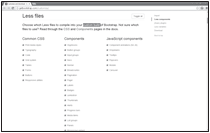

## Only use required parts of Javascript libraries and CSS frameworks

### Identifiers

| GreenIT | V2  | V3  |  V4  |
|:-------:|:---:|:---:|:----:|
|   811   | 77  |  40 |      |

### Categories

| Life cycle |  Tiers  |         Responsible          |
|:----------:|:-------:|:----------------------------:|
| 2. Design  | Network | Software Architect/Developer |

### Indications

| Priority | Implementation difficulty | Ecological impact |
|:--------:|:-------------------------:|:-----------------:|
|    4     |             4             |         4         |

|                      Saved resources                      |
|:---------------------------------------------------------:|
|                 Processor / RAM / Network                 |

### Description

JavaScript libraries such as jQuery and ready-to-use CSS frameworks (Bootstrap, skeleton, gumby, foundation, etc.)
are excellent tools used to create websites very quickly, as they almost meet all the most common requirements.
The downside is that only a small part of those libraries is generally used; and some of these frameworks and libraries
do not rely on a modular architecture, making users download entire libraries only to use a small percentage of their features.

Avoid using these libraries when possible (see https://youmightnotneedjquery.com)
or only keep their most used parts (see https://getbootstrap.com/customize).

Bundlers like Webpack allow the automatic removal of unused code. This is called tree shaking.

### Example

Some frameworks (here Bootstrap) allow you to create custom libraries that only contain the parts actually used by the site, 
thus reducing libraries size and resources used during execution.

### Validation rule

| The number of ...                | is equal to or less than |  
|----------------------------------|:------------------------:|
| used libraries with unused parts |            1             |
