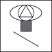

## Avoid using interface raster images

### Identifiers

| GreenIT |  V2  |  V3  |  V4  |
|:-------:|:----:|:----:|:----:|
|  161    | 21  | 35  |      |

### Categories

| Life cycle |  Tiers  |  Responsible  |
|:---------:|:----:|:----:|
| 5. Use | User/Device | User |

### Indications

| Priority |      Implementation difficulty       |  Ecological impact    |
|:-------------------:|:-------------------------:|:---------------------:|
| 4 | 4 | 4 |

|Saved resources                                    |
|:----------------------------------------------------------:|
|  Network  |

### Description

Choosing the most appropriate image format is essential in order to avoid transporting unrequired bytes so as to save bandwidth.
Furthermore, with the spreading of devices, screen sizes and increased resolutions, vector-based approaches should be favored over raster images. Interface will be independent from screen resolution by doing so, thus limiting technical debt. The first rule is to replace raster images (GIF, PNG, JPEG, WebP, etc.) with styles (CSS), pictos, glyphs, or icons provided by web fonts or standard fonts (already installed on the users' devices). This doesn't require any additional resources to download. If it isn't possible to use CSS or standard fonts you can also:

- use webfonts
- use a vector image in standard SVG format

### Example

This 198 × 198 pixel image size is:
  - 118 KB in uncompressed raster format;
  - 6.5 KB in JPEG (90% compression);
  - 3.8 KB in PNG;
  - 0.7 KB in minified SVG format.

In this particular case, vector format is 5 to 10 times lighter than raster format while being infinitely resizable
### Validation rule

| The number of ...     | is equal to or less than   |  
|-------------------|:-------------------------:|
| raster images for the tested URL  | 5  |
