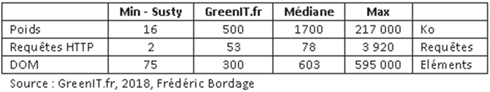

## Utiliser un thème léger
### Indications
| Degré de priorité |      Mise en oeuvre       |  Impact écologique    | 
|-------------------|:-------------------------:|:---------------------:|
| Prioritaire       |  Standard                 | Fort                  | 

|Ressources Economisées                                      |
|:----------------------------------------------------------:|
| Processeur / Mémoire vive / Réseau / Requêtes / Stockage |

### Règle
La plupart des thèmes clés en main disponibles pour les principaux CMS privilégient l’esthétique et la richesse fonctionnelle au détriment de l’efficience, de l’accessibilité, et de l’écoconception. Avant de choi- sir un thème, il est indispensable de vérifier ses principaux para- mètres techniques : taille du DOM, poids, et nombre d’allers-retours avec le serveur. On préférera un thème de conception minimaliste
– pas d’image ou d’icône pour l’interface, pas de composant impac- tant tels que carrousel et Google Maps dynamique, etc. – quitte à ajouter des fonctionnalités essentielles en fonction de son usage. Sous Wordpress, on peut par exemple débuter avec SustyWeb (https:// sustywp.com/) dont les mensurations sont impressionnantes de légè- reté : 16 Ko (7 Ko compressé), 2 requêtes HTTP et un DOM constitué de seulement 75 éléments.

### Exemple

### Principe de validation

| Le nombre ...     | est inférieur ou égal à   |  
|-------------------|:-------------------------:|
| d'éléments du DOM du thème  | 700  |
